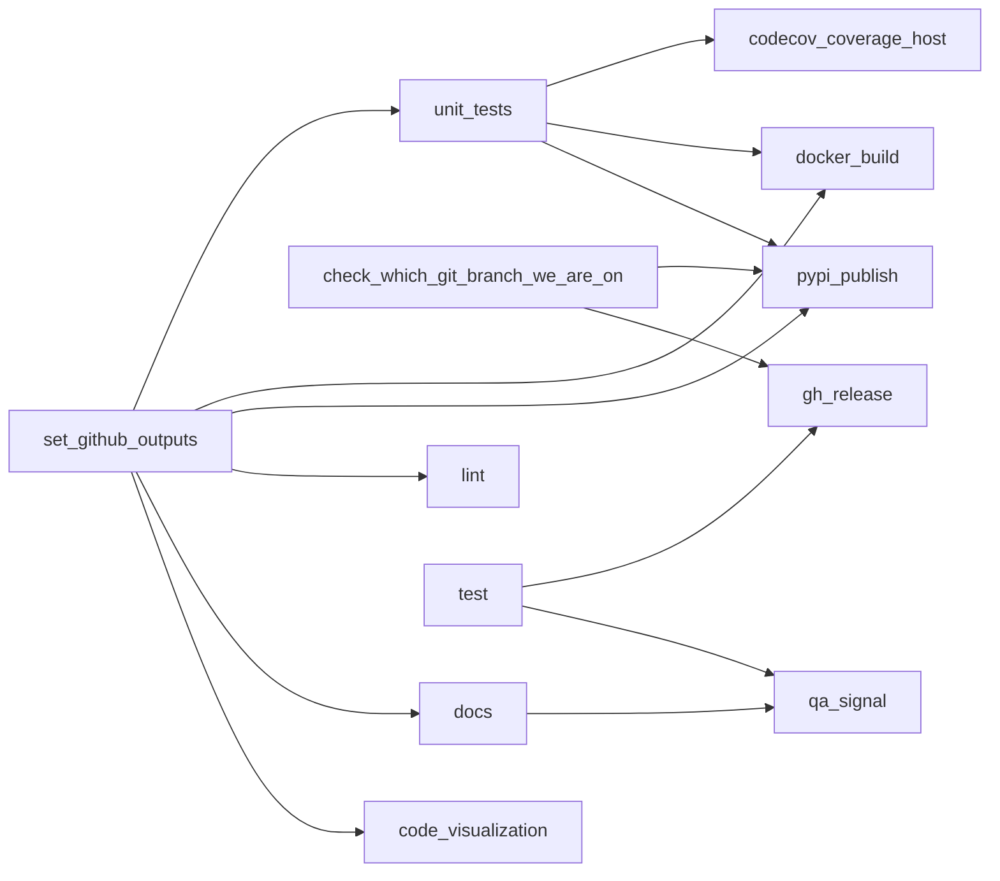

```mermaid
graph LR;
  set_github_outputs --> unit_tests
  unit_tests --> codecov_coverage_host
  set_github_outputs --> docker_build
  unit_tests --> docker_build
  set_github_outputs --> pypi_publish
  unit_tests --> pypi_publish
  check_which_git_branch_we_are_on --> pypi_publish
  set_github_outputs --> lint
  set_github_outputs --> docs
  set_github_outputs --> code_visualization
  test --> gh_release
  check_which_git_branch_we_are_on --> gh_release
  test --> qa_signal
  docs --> qa_signal
```
