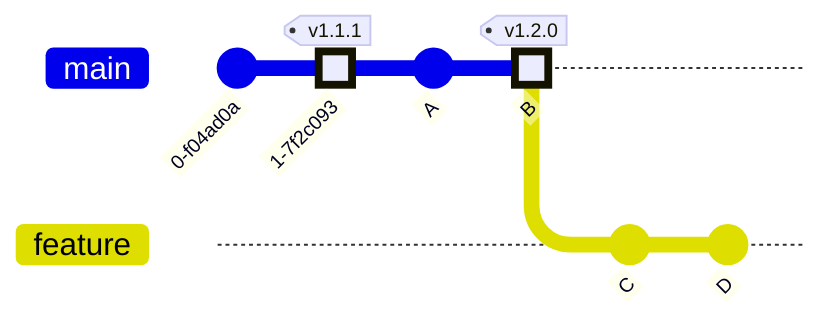

# Commit Ranges - Git Log 

## Double Dot `..`

Most common range specification

> Range of commits that are reachable from one commit but not from the other

```
ref_1..ref_2
```

> All commits reachable from `2nd Ref` thbut not from `1st Ref`.

It is a shorthand for `^ref_1 ref_2`


### Example 1


| Expression | Logic | Commits | Use Case |
| - | - | - | - |
| `log v1.2.0..feature` | Reachable from `feature` but not from `v1.2.0` | `'D, C'` | Find commits for **Next Release** |
| `log main..feature` | Reachable from `feature` but not from `main` | `'D, C'` | Find commits for **Next Release** |
| `log feature..main` | Reachable from `main` but not from `feature` | `''`| This is useful if you want to keep the experiment branch up to date and preview what you’re about to merge. |

### Example 2


| Expression | Logic | Commits | Use Case |
| - | - | - | - |
| `log v1.2.0..feature` | Reachable from `feature` but not from `v1.2.0` | `'D, C'` | Find commits for **Next Release** |
| `log main..feature` | Reachable from `feature` but not from `main` | `'D, C'` | Find commits for **Next Release** |
| `log feature..main` | Reachable from `main` but not from `feature` | `'F, E'`| Before `git merge main`; useful if you want to keep the feature branch up to date with `main` and preview what you’re about to merge. |

## Triple Dot `...`

The 3rd (along with `double-dot` and `mutliple-points` range-selection syntax.

> All the commits that are reachable by either of two references but not by both of them.

> All unique commits

### Example 1


| Expression | Logic | Commits | Use Case |
| - | - | - | - |
| `log v1.2.0...feature` | All Unique | `'D, C'` | Find commits for **Next Release** |
| `log feature...v1.2.0` | All Unique | `'D, C'` | Find commits for **Next Release** |
| `log main...feature` | All Unique | `'D, C'` | Find commits for **Next Release** |
| `log feature...main` | All Unique | `'D, C'` | Find commits for **Next Release** |

### Example 2


| Expression | Logic | Commits |
| - | - | - |
| `log v1.2.0...feature` | All Unique | `'D, C'` |
| `log feature...v1.2.0` | All Unique | `'D, C'` |
| `log main...feature` | All Unique | `'F, E, D, C'` |
| `log feature...main` | All Unique | `'D, C, F, E'` |
